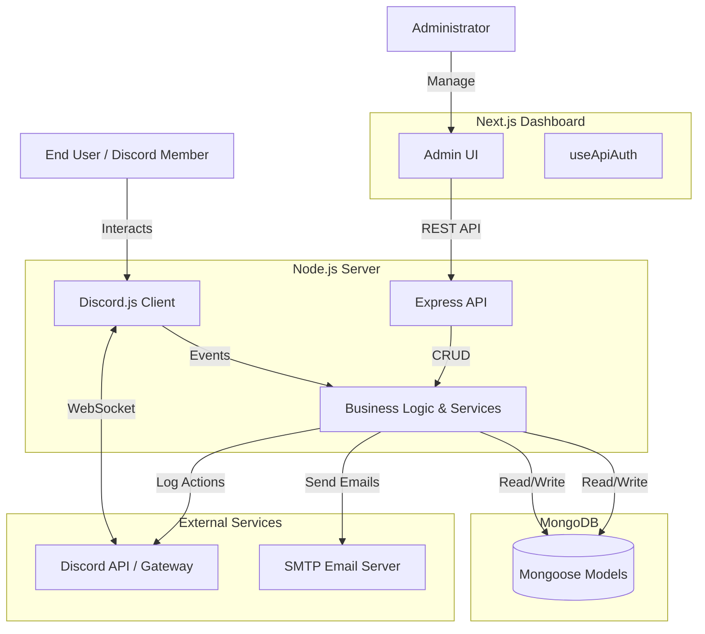
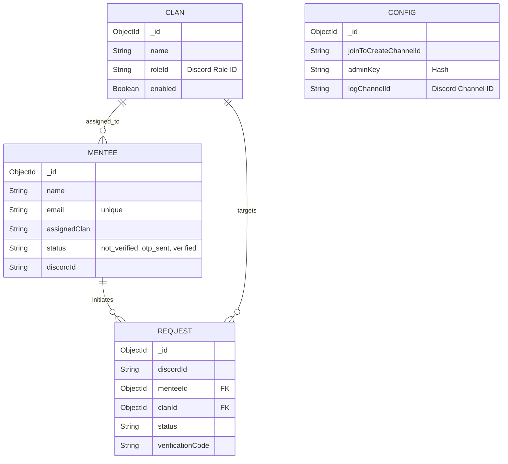
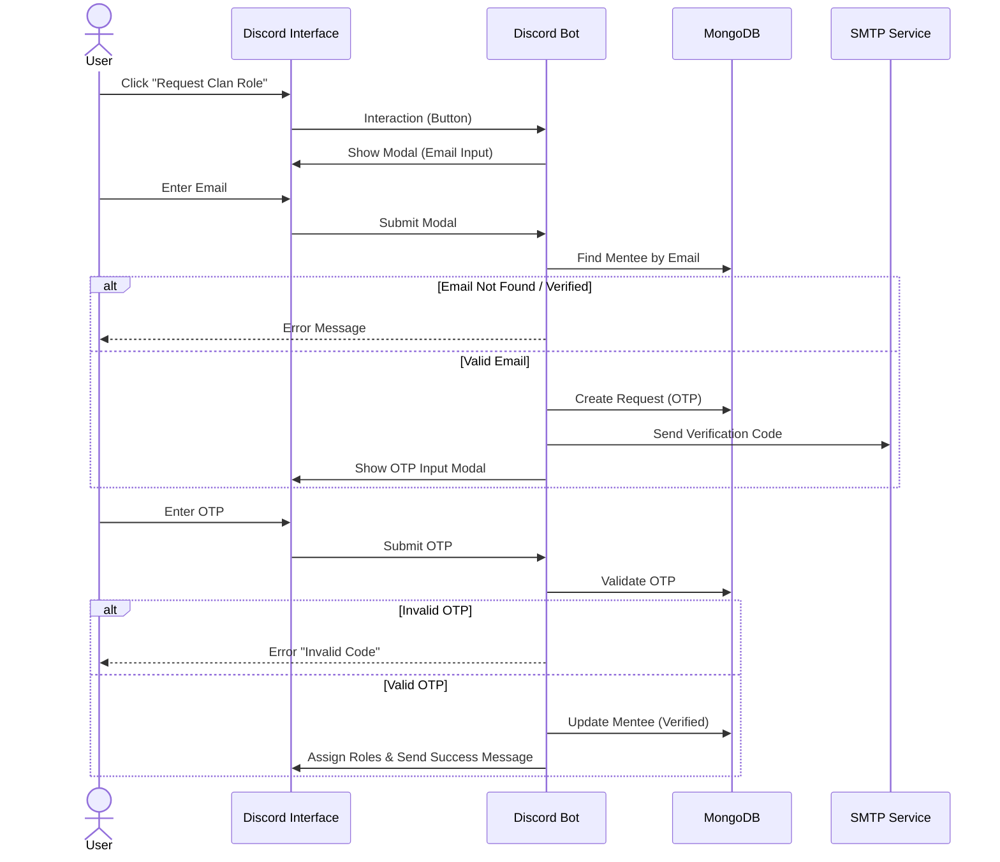

# System Architecture & Technical Reference

This document provides a detailed technical overview of the DevWeekend Discord Bot ecosystem, including architecture diagrams, database schemas, and workflow sequences.

## 1. High-Level Architecture

The system is composed of a **Node.js/Express Backend** which serves both the API and the Discord Gateway connection, and a **Next.js Frontend** for administration.



---

## 2. Database Schema

The application uses MongoDB. Below is the Entity-Relationship diagram representing the Mongoose models.



---

## 3. Verification Workflow

This sequence diagram illustrates the user journey for verifying their email and getting a Clan Role.



---

## 4. Voice Channel Automation ("Join to Create")

The logic for handling dynamic voice channel creation is handled in `voiceStateUpdate.js`.

```mermaid
flowchart TD
    Start([User Joins Voice Channel]) --> CheckChannel{"Is 'Join to Create' Channel?"}
    CheckChannel -- No --> End([Ignore])
    CheckChannel -- Yes --> FetchRoles[Fetch User Roles & Clams]
    
    FetchRoles --> CountMatches{Count Clan Roles}
    
    CountMatches -- 0 --> End
    
    CountMatches -- 1 --> CreateChannel[Create/Find Channel: "ClanName Clan Meet"]
    CreateChannel --> MoveUser[Move User to New Channel]
    
    CountMatches -- >1 --> SendDM[Send DM: Select Clan]
    SendDM --> WaitSelection[Wait for User Selection]
    WaitSelection --> CreateChannel
```

---

## 5. API Reference

### Auth
*   `POST /api/auth/login`: Validate Admin Key.

### Stats
*   `GET /api/stats`: Retrieve dashboard analytics (Counts, Top Clans, Recent Activity).

### Mentees
*   `GET /api/mentees`: List all mentees.
*   `POST /api/mentees`: Add single mentee.
*   `POST /api/mentees/upload`: Bulk upload via CSV.
*   `DELETE /api/mentees/:id`: Remove mentee.

### Clans
*   `GET /api/clans`: List all clans.
*   `POST /api/clans`: Create new clan.
*   `PUT /api/clans/:id`: Update clan (Name, RoleID).
*   `DELETE /api/clans/:id`: Delete clan.

### Config
*   `GET /api/config`: Get system config.
*   `PUT /api/config`: Update config (Trigger Discord Message Update).

---

## 6. Project Structure

### Backend
*   **`src/bot`**: Contains `handlers` (Button, Modal) and `events` (Ready, user interactions).
*   **`src/models`**: Mongoose Schemas.
*   **`src/routes`**: API Endpoint definitions.
*   **`src/services`**: Core logic (Email, Config, Stats).

### Frontend
*   **`src/app/dashboard`**: Main admin interface pages.
*   **`src/components`**: Reusable UI components (StatsCard, Tables).
*   **`src/hooks`**: Custom hooks (`useApiAuth`).
